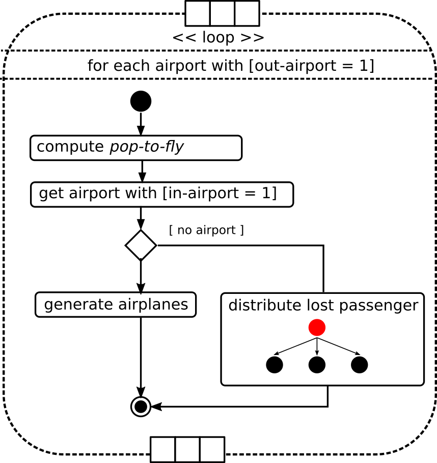

= gestion des départs

== Signature

Une seule fonction regroupe actuellement l'ensemble des traitements permettant

- Le calcul des populations destinés à partir
- La construction des agents avions `MobileGroup`

.Arguments de la fonction
[options="header"]
|===
| argument de la fonction |signification
| #instantaneous-total-population-to-fly | stock de population susceptible de partir, cumulé sur l'ensemble des noeuds.
| #airplane-size | taille de l'avion 
| #strategy-redistribution | booléen pour indiquer si il y a redistribution ou pas des populations en cas de non départ
|===

Les populations (`#cumulated-pop-flight-expected-float` et `#potential-population-departure`) qui sont passés en paramètres de cette fonction sont mis à jour à chaque nouvelle itération du modèle (`ticks`). Le calcul de ces populations est décrit sur la page décrivant la link:./procedure-principale.adoc[procédure principale].

== Mise à jour de la population de chaque noeud

Première partie, on calcule au niveau des noeud la population qui va être autorisé à voler.

[source,bash]
----
let potential-population-departure-by-node #potential-population-departure / number-nodes 

    ask nodes  
    [ 
      set stock-to-flight stock-to-flight + potential-population-departure-by-node 
    ]

----

On rapporte cette population à chaque noeud. En réalité, `#potential-population-departure` est une constante fixé lors du calibrage, qui n'a pas de raison de varier. On notera ici que l'on passe d'un entier à un flottant au niveau de la population.

Cette population est réattribué à chaque pas de temps pour chaque aéroport. Celle-ci se cumule dans `stock-to-flight` qui contient toujours une population résiduelle de population n'ayant pu être attribué aux avions.

On assume ici le fait que la populaiton sur l'aéroport est toujours plus grande que la population amené à voyager, ce qui explique l'absence de code testant cette hypothèse. En effet, il est important d'appuyer ici sur le fait que cette population reste à ce moment là encore abstraite. Tant que les agents ne montent pas véritablement dans l'avion, la population réelle (stock SIR) de l'aéroport n'est pas imputé !

== Résolution des autorisations

=== Premier bloc 

[source,bash]
----
 ask nodes with [out-airport = 1 and stock-to-flight >= gairplane-size ] 
  [
  ... 
  ]
----

On travaille sur un ensemble d'aéroports dont on sait la sortie ouverte (`out-airport = 1`), et pour lequel il existe une population prete à partir supérieure à la taille minimale d'un avion (par défaut 80) 

Dans ce premier bloc, on initialise les valeurs suivantes :

[source,bash]
----
    set has-one-plane-left-airport? true
    set pop-to-fly  int(stock-to-flight) // <1>
    set stock-to-flight stock-to-flight - pop-to-fly ; we consider we empty the stocks ! // <2>   
    set sum-pop-flight-expected sum-pop-flight-expected + pop-to-fly // <3>
----
<1> On arrondie le stock de population (float) pour le ramener à une valeur entière (int)
<2> On vide ce stock, mais attention, ici on conserve ce résidus de population faisant suite à cette discrétisation de la ligne précédente.
<3> Cette population *est mobilisé pour partir*, ce qui ne sera peut être pas le cas en réalité, du fait des stratégies. Ce qui explique le *expected* dans le nom de cette variable.

La condition ci-dessous teste ensuite pour chacun des aéroports de cet ensemble (`out-airport = 1`) si il existe au moins un un aéroport voisin, dont l'entrée (`in-airport`) est disponible pour recevoir un vol. 

[source,bash]
----
 ifelse(any? (([link-neighbors] of self) with [in-airport = 1]) ) 
    [
     // <1>
    ]
    [
     // <2>
    ]
----

=== embranchement (2)

Dans le cas **(2)** Si il n'existe pas d'aéroport de ce type, alors la population qui aurait du partir est considéré comme une perte économique qu'il faut comptabiliser. Attention, là encore cette population abstraite n'est pas soustraite des stocks ( car elle n'est jamais partie )

[source,bash]
----
      let nb-noeud count([link-neighbors] of self)
      let pop-to-distribute pop-to-fly / nb-noeud 
      
      ask [link-neighbors] of self 
      [
        set lost-passengers-in lost-passengers-in + pop-to-distribute
      ]
----

Par défaut, et comme on ne peut pas imaginer vers quel aéroports les avions aurait pu se diriger, on repercute la perte sur l'ensemble des aéroports rattachés à l'aéroport d'origine. On met à jour le compteur de passager perdus (attribut `lost-passengers-in`) de chacun des noeuds destination.

=== embranchement (1) 

Dans le cas **(1)**, ou l'algorithme trouve au moins un aéroport ( dont les variables d'E/S sont donc `in-airport = 1` et `out-airport = 1`), alors on autorise pour cet aéroport l'execution de la boucle suivante qui résoud les stratégies en même temps qu'elle construit et remplit les avions.

[source,bash]
----
    while [pop-to-fly >= #airplane-size]
    [
        let end-node one-of (([link-neighbors] of self))
     ...
    ]
----

A chaque itération, on considère la production d'un nouvel avion en direction d'une destination tirée au hasard. A ce stade, et parce que les vols ne sont pas calé sur les stratégies, mais les subissent, on ne sais pas si l'aéroport est soumis à une contrainte particulière. 

C'est pour cela qu'on teste dans un deuxième temps la condition de ce nouvel aéroport tiré au hasard.

[source,bash]
----
     ifelse [in-airport] of end-node = 0 
        [
         ;; ... cas (1) ...
        ]
        [
         ;; ... cas (2) ...
        ]
----

==== Cas (1) de l'aéroport fermé 

Si l'aéroport cible (`end-node`) est fermé (`in-airport = 0`), dans tout les cas l'aéroport cible (`end-node`) perd des voyageurs potentiels.

[source,bash]
----
  ask end-node 
  [
    set lost-passengers-in lost-passengers-in + gairplane-size
  ]
----

Deux possibilités sont ensuites envisageables, fonction de la valeur de `#strategy-redistribution` : 

* Si elle est a `false`, on considère le vol comme annulé, et on se retrouve dans le cas d'une perte de voyageurs qu'il faut comptabiliser, là encore coté aéroport cible.

[source,bash]
----
  if (#strategy-redistribution = false) 
  [
    set pop-to-fly pop-to-fly - #airplane-size
  ]
----

* Si cette variable est à `true` , alors on autorise la redistribution des passages vers un autre aéroport. Autrement dit, à la différence du code précédent, on ne fait rien, et le stock de population potentiellement distribuable (`pop-to-fly`) dans des vols pour cet aéroport reste inchangé.

==== Cas (2) de l'aéroport ouvert 

Si l'aéroport cible (`end-node`) est ouvert (`in-airport = 1`), un avion peut être généré, en appelant la fonction suivante.

[source,bash]
----
    let pop-which-leave-airport generate-MobileGroup self end-node gairplane-size
----          

Cette fonction `generate-MobileGroup` renvoie une population égale ou inférieure à la population indiquée par la taille de l'avion `gairplane-size` : `pop-which-leave-airport`. C'est en effet à ce moment là que la link:./strategies.adoc[stratégie individuelle] (culture du risque) est utilisée, si celle-ci est activée (`gstrategy3-riskCulture` = `true`).  

L'activation de cette dernière stratégie implique l'existence d'avion de taille fluctuante, fonction du nombre de personnes qui ont décidé de monter ou pas dans l'avion. Cette stratégie produit donc une forme de perte qu'il convient là aussi de comptabiliser, en utilisant la variable compteur (`lost-passengers-in`) de l'aéroport cible (`end-node`). 

[source,bash]
----
 ask end-node
  [
    set lost-passengers-in lost-passengers-in + (#airplane-size - pop-which-leave-airport)
  ]
  
  set sum-pop-flight-real (sum-pop-flight-real + pop-which-leave-airport)
  set pop-to-fly pop-to-fly - #airplane-size
----          

A partir de là, à chaque avion parti d'un aéroport, on met à jour la somme de population ayant effectivement embarqué (`sum-pop-flight-real`)

Peu importe alors pour le décompte de savoir si les avions partent plein ou moitié-vide, on considère pour la prochaine itération que l'avion est parti plein. On soustrait donc la taille de l'avion à la population restante susceptible de voler sur cet aéroport (`pop-to-fly - #airplane-size`).

Ces deux embranchements possibles précédemment décrit (cas 1 et 2) sont résumés dans le diagramme d'activité suivant : 

