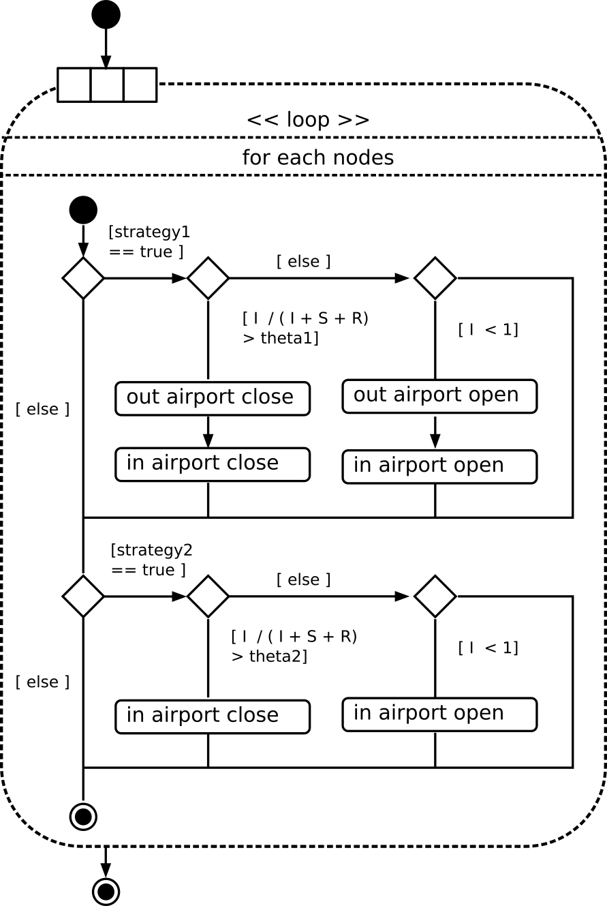

= gestion des entrees/sorties aeroports

[.right.text-center]

Un aéroport est constitué d'une entrée et d'une sortie.
Par défaut toutes les entrées et les sorties d'aéroports sont ouvertes ( in-airport = 1 et out-airport = 1) au début du programme.

Dans le cas de la [stratégie 1]()

[source,bash]
----
 if gstrategy1 = true 
 [
   ask node 
   [
     ifelse (I_Node / ( I_Node + S_Node + R_Node) > gtheta1 )
     [
       set out-airport 0
       set in-airport 0
     ]
     [
       set out-airport 1
       set in-airport 1
     ]
   ]
 ]
----
 
 
[source,bash]
----
if gstrategy2 = true 
   [
     ask node 
     [
       ifelse I_Node / ( I_Node + S_Node + R_Node) > gtheta2 
       [
         set in-airport 0
       ]
       [
         set in-airport 1
       ]
     ]
   ] 
----
