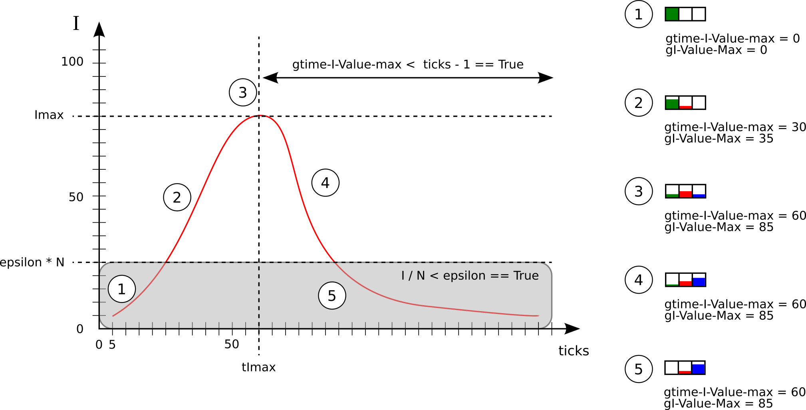

= procedure-principale.adoc

Le découpage et l'ordonnancement du code de cette procédure nommé `main-loop` est la suivante : 

. Mise à jour des états d'E/S des aéroports
. Calcul des conditions d'arrêts
. Itération du modèle
. Mise à jour des moniteurs de traffic 

== Mise à jour des états d'E/S des aéroports

[source,bash]
----
ask nodes[
    update-node-airport self
  ]
----

La mise à jour des aéroports est variable selon les différentes stratégies, la procédure qui se charge de modifier les états d'entrées et des sorties de chacun des aéroports est ainsi décrite plus en détail dans la page link:./gestionentreessorties_aeroports.adoc[gestion des entrées sorties des aéroports].

== Instanciation du traffic sur les noeuds

L'appel de la fonction `update-world` qui construit et distribue les avions , décrite sur la page link:./gestion_des_departs.adoc[gestion des départs] prend trois globales en paramètres

=== Entrées

 `gpotential-population-departure`::
Valeur calculée durant le link:./calibrage.adoc[calibrage] du modèle, celle-ci est une valeur de référence (constante) indiquant le stock de population disponible pour partir sur l'ensemble des aéroports à chaque pas de temps, avant application des stratégies.

 `gairplane-size`:: 
 La taille d'un avion tel que définit par l'utilisateur

 `gstrategy-redistribution` :: 
 Le paramètre de redistribution (oui/non) déterminant la façon dont doivent être comptabilisé les pertes de traffic en cas d'impossibilité d'atterir sur l'aéroport selectionné comme destination d'un avion (reroutage des populations, ou perte sèche).

=== Sorties

Celle-ci renvoie en retour deux populations, stockées là aussi dans des globales :

 `gsum-pop-flight-real`:: 
Population effectivement partie des aéroports, c'est à dire contenu dans les avions.

 `gsum-pop-flight-expected` :: 
Population qui aurait du partir des aéroports. En effet, du fait des différentes stratégies, il existe pour chaque nouvel avion prêt à partir, un différentiel entre la population destiné à monter dans un avion, et la population qui est effectivement monté dans l'avion.

== Mise à jour des moniteurs de traffic 

A partir de ces populations calculées par `update-world` à chaque itération, on construit deux globales cumulant ces valeurs sur plusieurs itérations : 

- `gcumulated-pop-flight-real`
- `gcumulated-pop-flight-expected`

La variable indiquant la réduction de traffic subit à chaque itération (`gout-traffic-reduction-instantaneous`) est calculé en faisant le différentiel entre ces deux variables :

[source,bash]
----
set gout-traffic-reduction-instantaneous (gsum-pop-flight-expected - gsum-pop-flight-real) / (max list gsum-pop-flight-expected 1)`
----

On fera attention donc dans ce calcul à une possible division par zéro, ce qui explique le code `(max list gsum-pop-flight-expected 1)`

Afin de garder en mémoire quel a été la réduction maximale de traffic en fin de simulation, on garde une trace de celle-ci grâce à la variable globale `gtaux-reduc-max` :

[source,bash]
----
    if (gtaux-reduc-max < gout-traffic-reduction-instantaneous) 
    [
      set gtaux-reduc-max gout-traffic-reduction-instantaneous
    ]
----

== Condition d'arrêts

 
[source,bash]
----
  if epidemy-has-begun? = 1 
  and gtime-I-Value-max < (ticks - 1) 
  and (compute-pop-total-with-state "I" < gEpsilon-stop) 
  [
    compute-end-indicator
  ]    
  
  if gduration-of-Epidemy > 0
  [
    stop
  ]
----
 
 
La condition d'arrêt, résumé dans le schéma ci-dessus, doit pour être validé, obtenir plusieurs objectifs : 

- Le pic épidémique est dépassé d'au moins un pas de temps : `gtime-I-Value-max < (ticks - 1)`
- La somme des infectés présent dans la simulation (avions + aéroports) calculé par l'appel de la fonction `compute-pop-total-with-state "I"` est inférieure à la valeur epsilon `gEpsilon-stop`.
  
Si la condition d'arrêt est remplie, alors la simulation est stoppée, et on peut calculer les différents indicateurs de sorties avec la fonction `compute-end-indicator`
  
== itération du monde 

  
  